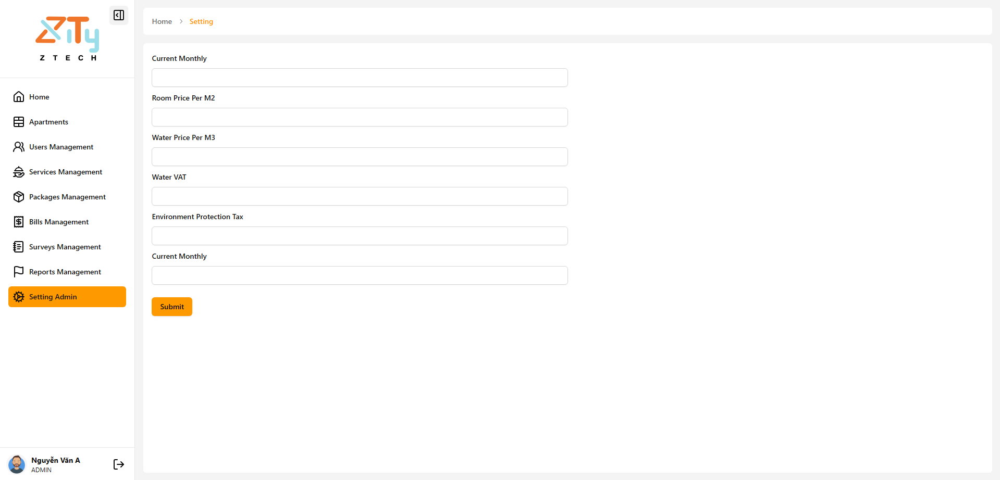

# Zity Apartment Management

## Team Members:

```bash
Saigon University ,Faculty of Information Technology ,Major in Software Engineering

| ID          | Full Name 
| 3121410379    Nguyen Tien Phat
| 3121410066    Bui Hong Bao
| 3121410070    Hoang Gia Bao
| 3121410087    Mai Trung Chinh
| 3121410401    Tran Nhu Phu Quang
| 3121410491    Bui Ngoc Thuc

```

## Project Description:

This web application was built to help residents in apartment

## Tech Stack Used:

### Front-end

```bash
    * React
    * Typescript
    * Redux Toolkit
    * Firebase
    * Zod
    * React-hook-form
    ---------------
    * Shadcn/ui
    * Lucide-react icons
    * Radix icons
```

### Backend

```bash
    * .NET
```

## Website Functions:

```bash
#USER
   * Login / Log out / Forgot password
   * Allows users to pay electric & water bills (integrate payment method with Momo, VNPay),
   * Allows users to create/edit/delete a report,
   * Send notifications to the user if there are any packages sent to them.
   * Allows users to create/edit/delete a survey


#ADMIN
   *
```

### Screens

| Home User Page |  Report Page  |
|---|---|
|   |    |

| Bill Page |  Survey Page  |
|---|---|
|   |    |

| User Page |  Apartment Page  |
|---|---|
|   |    |

| Setting Page |  Survey Doing Page |
|---|---|
|   |   |


### Make sure to star the repository if you find it helpful!

<a href="https://github.com/BuiBao3103/ZiTy/graphs/contributors"></a>
